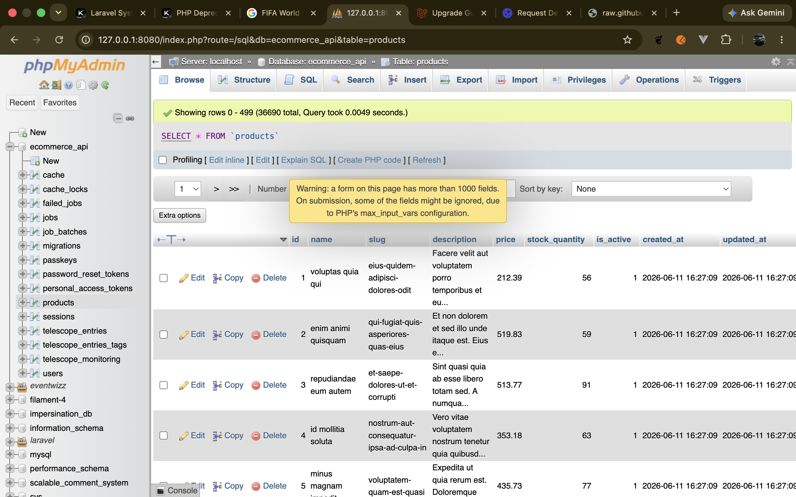
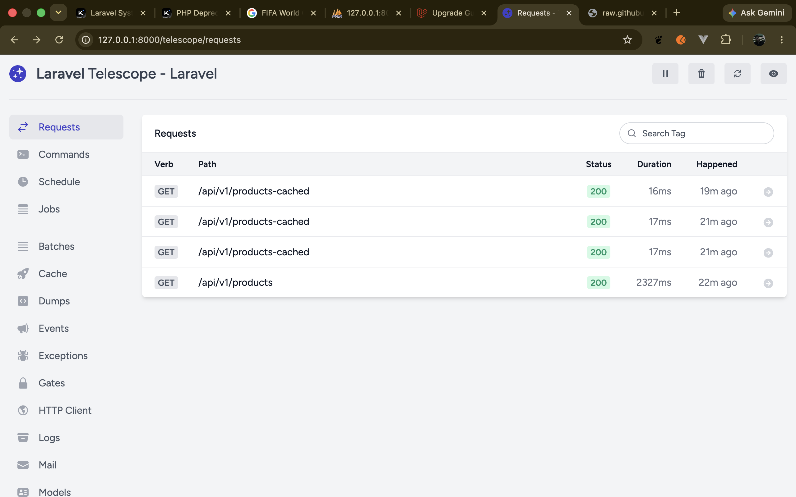
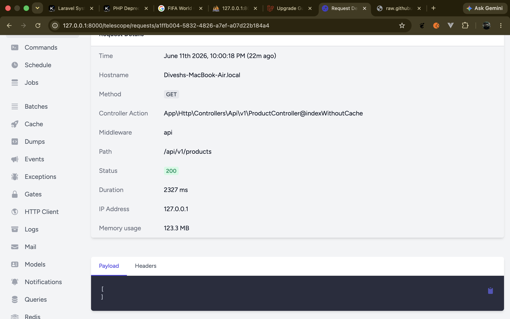
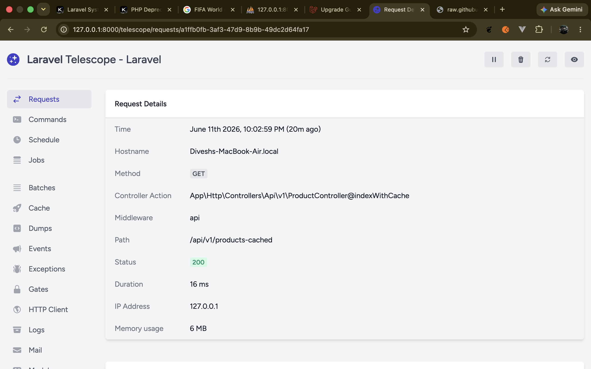

# Ecommerce API — Interview Prep

This repository is a focused, example Laravel REST API used for interview preparation and learning. It demonstrates building a small but realistic e-commerce backend with database migrations, factories & seeders, API versioning, authentication primitives, caching, and automated tests.

Key goals:

- Provide a clean API surface for a products catalog.
- Show common backend patterns: migrations, factories, seeders, controllers, and resource routes.
- Demonstrate caching, pagination, and performance-oriented techniques.
- Ship a testable codebase for quick evaluation during interviews.

Features

- Product catalog API with list, show, and cached-list endpoints (see routes in `routes/api.php`).
- Database factories and seeders to generate realistic demo data (`database/factories`, `database/seeders`).
- Example authentication and token handling via Laravel's auth/sanctum/passkeys stack where configured.
- Performance optimizations including cached endpoints (e.g. `/api/v1/products-cached`), eager loading, and pagination.
- Tests using Pest/PHPUnit present under `tests/` to validate behavior.

Quick start
Prereqs: PHP (8.x), Composer, MySQL/SQLite, Node & npm (optional for front-end assets).

1. Install dependencies

```bash
composer install
npm install # optional
```

2. Copy env and configure DB

```bash
cp .env.example .env
php artisan key:generate
# edit .env: DB_CONNECTION, DB_DATABASE, etc.
```

3. Run migrations & seed demo data

```bash
php artisan migrate --seed
```

4. Serve the app

```bash
php artisan serve --host=127.0.0.1 --port=8000
```

API overview

- GET /api/v1/products — paginated products list, supports filtering and sorting if implemented.
- GET /api/v1/products-cached — cached products list for performance testing.
- GET /api/v1/products/{id} — product details.
- POST /api/v1/products — create product (auth required).

Example curl (public list):

```bash
curl -s "http://127.0.0.1:8000/api/v1/products?page=1&per_page=10" | jq .
```

Example curl (cached list):

```bash
time curl -s http://127.0.0.1:8000/api/v1/products-cached
```

Authentication
This project includes examples for token-based auth and passkeys (see `app/Providers/FortifyServiceProvider.php` and related config under `config/fortify.php`). For API tokens prefer Sanctum or personal access tokens (`personal_access_tokens` migration is present).

Testing
Run the test suite with:

```bash
php artisan test
# or
./vendor/bin/pest
```

Developer notes

- Models: `app/Models/Product.php`, `app/Models/User.php`.
- Controllers: API controllers are under `app/Http/Controllers/Api/v1`.
- Factories & seeders: `database/factories`, `database/seeders`.
- Migrations list: see `database/migrations` for schema history and examples (products, passkeys, personal access tokens, two-factor additions).
- Caching: Cached endpoints are intended for benchmarking and demonstrating cache invalidation strategies.

Where to start when reviewing the code

- Inspect the `routes/api.php` to see what endpoints are exposed.
- Review `app/Http/Controllers/Api/v1/ProductController` for request handling and caching usage.
- Check `database/factories/ProductFactory.php` for generated data shape.
- Run `php artisan migrate --seed` and then call the cached endpoint to validate performance.

Contributing
This repo is intended as a learning and interview artifact. If you want to propose changes, please open an issue or submit a pull request with a focused scope.

License
This project follows the MIT license inherited from the base Laravel template.

Screenshots
Below are Telescope screenshots that demonstrate the performance difference between the cached and non-cached product endpoints. Add the actual image files to `docs/` with the filenames shown so they render here (`docs/telescope-requests.png`, `docs/telescope-request-detail-uncached.png`, `docs/telescope-request-detail-cached.png`).








